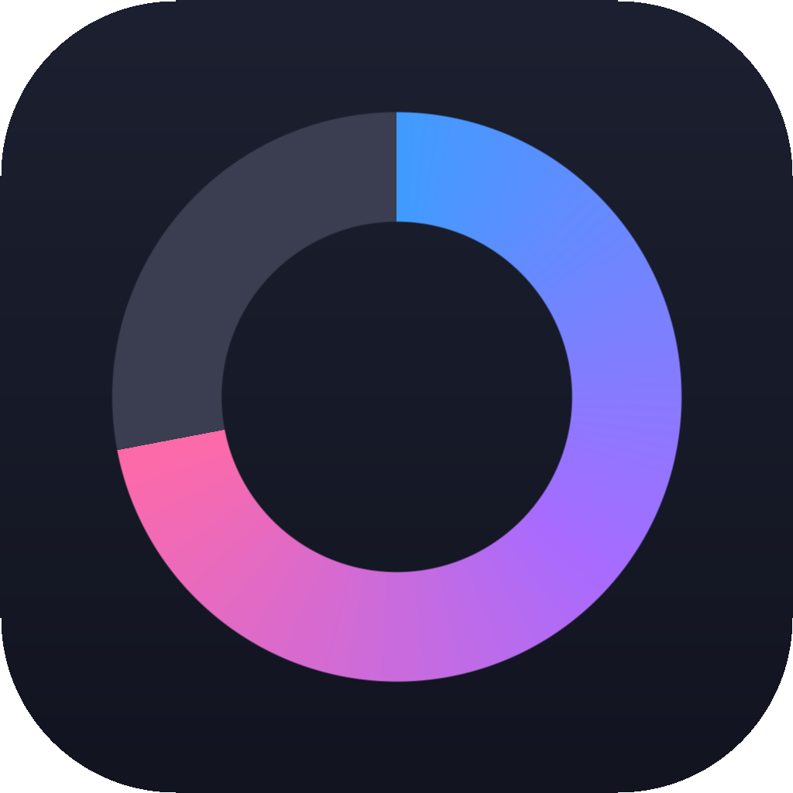
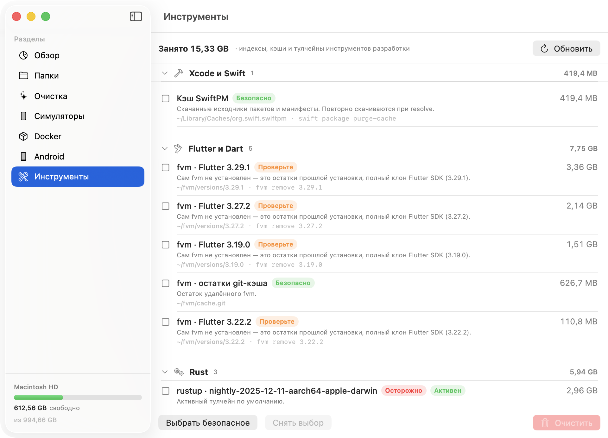

# DiskLens



Нативное приложение для macOS: показывает, куда уходит место на диске, и безопасно
освобождает его. Заточено под тех, у кого диск съедают инструменты разработки —
Xcode, симуляторы, Docker, Android SDK, Flutter, Go, Rust, локальные модели ИИ.

SwiftUI, без внешних зависимостей, бандл 2,8 MB.

## Установка

**Готовое приложение** — скачайте `DiskLens.dmg` со [страницы релизов](../../releases),
перетащите в «Программы».

Релизы подписаны Developer ID и нотаризованы Apple — открываются обычным двойным кликом.

**Из исходников** (Xcode 15+ / Swift 5.9+, macOS 14+):

```bash
git clone https://github.com/nvsces/DiskLens.git
cd DiskLens
./make_app.sh && open DiskLens.app
```

`make_app.sh` собирает через `xcodebuild` универсальный бинарник (arm64 + x86_64).
Сборка через `swift build` не годится для распространения: она прописывает в бинарник
rpath на локальный Xcode-тулчейн, и на машине без Xcode приложение не запускается.

`./make_dmg.sh 1.0` соберёт DMG для распространения: подпишет Developer ID с hardened runtime,
отправит на нотаризацию и прикрепит штамп. Без сертификата в связке ключей скрипт честно
предупредит и подпишет ad-hoc. Разовая настройка нотаризации:

```bash
xcrun notarytool store-credentials notary \
  --apple-id <ваш@apple.id> --team-id <TEAM_ID> --password <app-specific-password>
```

**В Xcode** — откройте `DiskLens.xcodeproj` (⌘R для запуска, отладчик и превью работают).
Чтобы подписать своей учётной записью разработчика: выберите таргет DiskLens →
**Signing & Capabilities** → Team. Для распространения нужен сертификат
**Developer ID Application**, иначе Gatekeeper на чужих машинах покажет предупреждение.

Проект и пакет собирают одно и то же из `Sources/DiskLens`; при добавлении файла
он подхватится SwiftPM автоматически, а в `.xcodeproj` его нужно добавить в таргет.

## Разделы

| Раздел | Что делает |
|---|---|
| **Обзор** | заполненность диска, сколько можно освободить |
| **Папки** | обход дерева по размеру с drill-down, как в Finder, но по весу |
| **Очистка** | 16 категорий типового мусора с оценкой риска |
| **Симуляторы** | устройства и рантаймы iOS через `simctl`, кэш клавиатуры |
| **Docker** | образы, контейнеры, тома и кэш сборки через `docker` CLI |
| **Android** | AVD и пакеты SDK через `avdmanager` / `sdkmanager` |
| **Инструменты** | индексы и кэши Xcode, SwiftPM, Flutter, Go, Rust, Gradle, npm, pip, Ollama, IDE |



## Главный принцип

DiskLens не удаляет файлы там, где у инструмента есть собственная команда очистки:
симуляторы — через `simctl`, образы Docker — через `docker`, пакеты SDK — через `sdkmanager`,
кэши — через `dart pub cache clean`, `go clean -modcache`, `brew cleanup` и так далее.
Так реестры инструментов остаются согласованными: прямое удаление папки симулятора,
например, оставляет в Xcode «призрака», который ломает список устройств.

Всё остальное уходит **в Корзину**, а не стирается. Безвозвратное удаление — только
явным переключателем в настройках.

Каждая находка помечена уровнем риска: 🟢 безопасно (регенерируется само) ·
🟠 проверьте (восстановимо, но требует времени или сети) · 🔴 осторожно (можно потерять данные).
Кнопка «Выбрать безопасное» отмечает только зелёное.

---

## Подробности

**Обзор** — кольцо заполненности диска, сколько занято/свободно и сколько можно освободить.

**Папки** — обход дерева с сортировкой по убыванию размера. Двойной клик — зайти внутрь,
хлебные крошки и кнопка «‹» — вернуться. Правый клик — «Показать в Finder».
Можно выбрать любую папку через «Выбрать папку…».

**Очистка** — поиск по типовым местам накопления мусора, сгруппированный по категориям.

**Симуляторы** — устройства и рантаймы CoreSimulator, сгруппированные по версии iOS/watchOS/tvOS,
с размерами и датой последнего запуска. Все операции идут через `xcrun simctl`, поэтому реестр
Xcode остаётся согласованным — папки в `~/Library/Developer/CoreSimulator` напрямую не трогаются.

- **Стереть** (`simctl erase`) — устройство остаётся, данные приложений удаляются. Самый безопасный
  способ вернуть место: Xcode ничего не заметит.
- **Удалить** (`simctl delete`) — устройство исчезает из Xcode. Та же модель создаётся заново за секунды.
- **Удалить рантайм** (`simctl runtime delete`) — освобождает 6–9 GB на версию, но образ придётся
  скачать заново; приложение предупреждает, если на рантайме остались устройства с данными.
- **Недоступные** (`simctl delete unavailable`) — устройства, чей рантайм уже удалён.
- Меню **Неиспользуемые** выбирает устройства с данными, не запускавшиеся 30/90 дней.

Правый клик по устройству — **Открыть в Папках** (структура данных устройства в разделе «Папки»),
**Показать в Finder** и, если найден, **Удалить кэш клавиатуры**. Это известная утечка симулятора:
`data/Library/Caches/com.apple.keyboards/images` растёт до десятков гигабайт независимо от приложений.
Кэш не входит в реестр CoreSimulator, поэтому удаляется как обычная папка после выключения устройства;
приложения и их данные не затрагиваются. Устройства с таким кэшем больше 1 GB получают оранжевый бейдж.

«Пустая заготовка» — устройство без данных, которое Xcode создаёт автоматически для каждой модели
на каждом рантайме. Удалять их бессмысленно: появятся снова. Старые билды одной версии рантайма
(после обновления Xcode) помечаются как неиспользуемые — CoreSimulator берёт только самый новый.

**Docker** — образы, контейнеры, тома и кэш сборки Docker Desktop. Всё через `docker` CLI:
`Docker.raw` — единый виртуальный диск, его содержимое знает только демон, и только он может
корректно освобождать место (файл сжимается сам через минуту-две после удаления).

- Образы группируются по ID: несколько тегов одного образа — одна строка с бейджем «+N тег.»,
  удаляются все теги сразу, иначе слои остались бы. «Используется» — образ держит контейнер,
  docker откажется его удалять. Итоги в шапке берутся из `docker system df`, где общие слои
  посчитаны один раз.
- Контейнеры: запущенные останавливаются перед удалением; тома при этом не трогаются.
- Тома: удалять можно только не подключённые. Подтверждение отдельно предупреждает,
  что это данные (базы, состояние) без возможности восстановления.
- Кэш сборки: `docker builder prune` — только неиспользуемые записи, пересоздаётся при сборке.
- Меню «Выбрать»: образы без контейнеров старше 30/90 дней, остановленные контейнеры,
  неподключённые тома.

Если демон не запущен, раздел предлагает запустить Docker Desktop и ждёт его до минуты.

**Android** — виртуальные устройства (`~/.android/avd`) и пакеты SDK: системные образы, NDK,
build-tools, platforms, sources, CMake — каждый с версиями и размером.

- **Снапшоты** — только снимки состояния выбранных AVD: эмулятор стартует «холодно», данные целы.
- **Сбросить** — эквивалент Wipe Data в Device Manager: устройство остаётся, приложения и данные удаляются.
- **Удалить** — AVD через `avdmanager delete`, пакеты через `sdkmanager --uninstall`; всё можно
  скачать заново в SDK Manager. Системные образы, на которых есть AVD, заблокированы.
- **Выбрать устаревшее** — все версии NDK/build-tools/platforms кроме самой новой из установленных,
  образы без AVD и «остатки загрузки» (папки, о которых sdkmanager не знает — прерванные скачивания).
- Пока эмулятор запущен, операции с AVD отклоняются.

NDK стоит проверять внимательнее остального: Gradle-проект может пинить конкретную `ndkVersion`,
и её удаление вызовет повторную загрузку 3 GB при следующей сборке — не поломку, но ожидание.

**Инструменты** — индексы, кэши и тулчейны инструментов разработки, сгруппированные по инструменту:

| Группа | Что внутри |
|---|---|
| Индексы | Dart Analysis Server (`~/.dartServer`), Xcode ModuleCache / SymbolCache / `Index.noindex` по проектам, SwiftUI Previews, XCTestDevices, SourceKit-LSP (`.build/index-build`) |
| Xcode и Swift | кэш SwiftPM, Products, IB Support |
| Flutter и Dart | версии fvm (с проверкой, кто их пинит в `.fvmrc`), pub cache, артефакты движка и загрузки SDK |
| Go | кэш сборки, кэш модулей |
| Rust | тулчейны rustup (активный помечен), cargo registry/git |
| JVM и Android | Gradle caches/daemon/wrapper, Android build cache, Maven, Kotlin/Native |
| JavaScript | npm/npx, Yarn, pnpm, node-gyp, nvm, Puppeteer, Cypress, Bun |
| Python | pip, uv, pipx |
| Модели ИИ | модели Ollama (по manifest'ам, с размером), Hugging Face Hub, whisper |
| IDE и Homebrew | JetBrains, VS Code / Cursor (Cache, CachedData, GPUCache, workspaceStorage), Homebrew |

Если инструмент удалён, а его данные остались (например, снесли fvm, а `~/fvm/versions` на 6,6 GB
никуда не делся), команда очистки не сработает — DiskLens это распознаёт, пишет в описании
«сам fvm не установлен» и убирает папку в Корзину. Команды ищутся в интерактивном shell
(`zsh -ilc`), потому что PATH к fvm, Flutter, go и nvm у вас дописан в `~/.zshrc`, который
при обычном `zsh -lc` не читается.

Где у инструмента есть своя команда очистки, используется она, а не удаление папки:
`swift package purge-cache`, `dart pub cache clean`, `fvm remove`, `go clean -cache` / `-modcache`,
`rustup toolchain uninstall`, `npm cache clean`, `pnpm store prune`, `pip cache purge`, `ollama rm`,
`brew cleanup`. Команда видна в строке и в подтверждении. Остальное — в Корзину. Команды
запускаются через login-shell, чтобы был виден PATH пользователя (fvm, rustup, go, brew).

Индексы — самое безопасное из всего: они не влияют на сборку, IDE пересоздаёт их в фоне.
Тулчейны и модели — «Проверьте»/«Осторожно»: скачивать заново долго. Активный тулчейн и версии
Flutter, на которые ссылаются проекты, помечены и по кнопке «Выбрать безопасное» не выбираются.

## Категории и безопасность

Каждая категория помечена уровнем риска:

- 🟢 **Безопасно** — система пересоздаст сама: кэши приложений, DerivedData, логи,
  отчёты о сбоях, кэши npm/pip/Homebrew/Go/Gradle, iOS DeviceSupport, кэши симуляторов.
- 🟠 **Проверьте** — обычно мусор, но стоит взглянуть: `node_modules`, папки сборки
  (`build`, `target`, `.build`, `Pods`, `.dart_tool`, `.gradle`), архивы Xcode, старые загрузки, Корзина.
  Папки сборки пересоздаются при следующем билде — теряется только его время, поэтому для Flutter-
  и Gradle-проектов это самая крупная и при этом безопасная категория.
- 🔴 **Осторожно** — можно потерять данные: бэкапы iPhone, данные Docker, вложения Почты.

Кнопка **«Выбрать безопасное»** отмечает только зелёную группу.

## Что защищает от ошибки

- **Удаление в Корзину по умолчанию.** Файлы можно вернуть. Безвозвратное удаление —
  только явным переключателем в Настройках (⌘,).
- **Чёрный список путей.** `/System`, `/usr`, `/bin`, `/Applications`, `~/Documents`,
  `~/Desktop`, `~/.ssh`, `~/.gnupg`, сами `~/Library/Caches` и `~/Library` и другие
  не могут быть удалены ни при каких правилах — проверка стоит и при поиске, и при удалении.
- **Дата вместо скрытого фильтра.** Папки сборки и `node_modules` показываются все, с датой
  изменения; менявшиеся за последние 7 дней помечены бейджем «Активный». Переключатель
  «Скрыть изменённые за 7 дней» убирает их из списка и из выбора. Загрузки — только старше 90 дней.
  Мелочь ниже порога размера не показывается.
- **Подтверждение** с указанием количества объектов и объёма перед любым удалением.

После переноса в Корзину место освобождается только когда Корзина очищена — приложение
об этом напоминает в баннере результата.

## Как считается размер

Берётся размер **на диске** (`totalFileAllocatedSize`), а не логический: для разреженных
файлов и сжатых APFS-файлов разница бывает кратной. Символические ссылки не разыменовываются,
бандлы (`.app`, `.photoslibrary`) считаются одним объектом. Скан не выходит за пределы
стартового тома, чтобы не уползти на внешний диск или сетевую шару.

Свободное место берётся как `volumeAvailableCapacityForImportantUsage` — это то же число,
что показывает «Об этом Mac», с учётом вытеснения очищаемого кэша.

## Структура

| Файл | Назначение |
|---|---|
| `DiskScanner.swift` | параллельный обход дерева, размеры на диске |
| `JunkRules.swift` | декларативные правила категорий мусора |
| `JunkFinder.swift` | применение правил к диску |
| `SafeDelete.swift` | защищённые пути и удаление в Корзину |
| `AppModel.swift` | состояние приложения (`@MainActor`) |
| `OverviewView` / `ExplorerView` / `JunkView` | три раздела UI |

Новую категорию мусора можно добавить одной записью в массив `JunkRules.categories` —
движок поиска менять не нужно.
